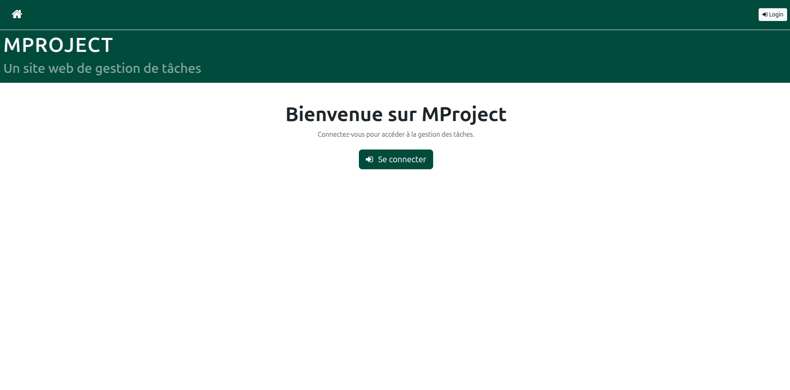
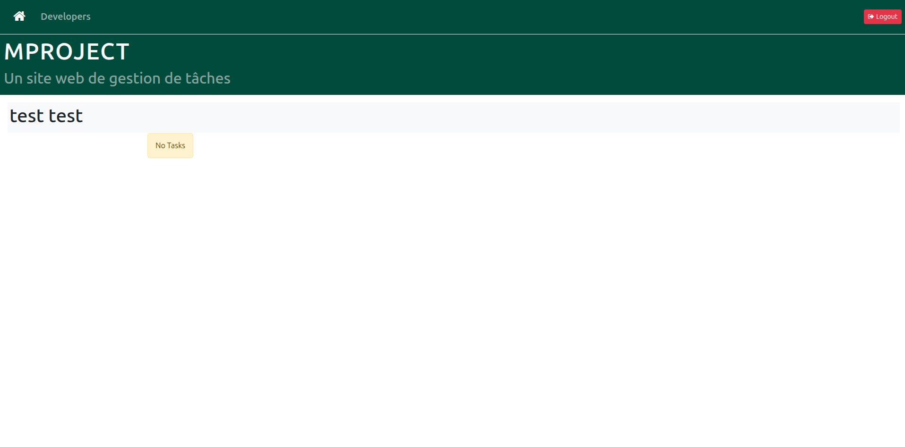
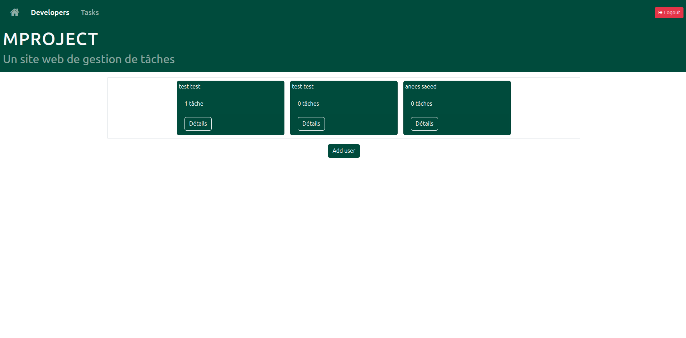
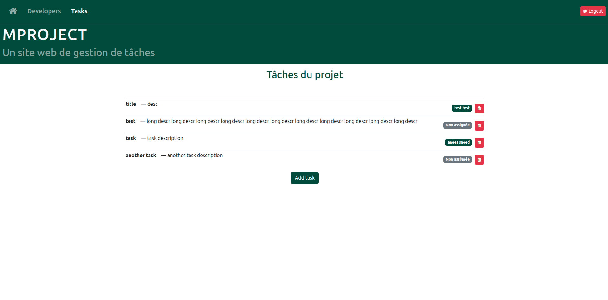

# Django Introduction Project

This project was created as part of an **introductory school tutorial** to learn the fundamentals of Django.  
It includes basic CRUD operations, templates, forms, authentication.

> ⚠️ This project was completed following a guided school exercise and is not an original work.

## Screenshots

### Home Page Access Control

| State | Screenshot |
|--------|-------------|
| Not logged in — only basic navigation visible |  |
| Logged in as superuser — both **Developer** and **Tasks** tabs visible |  |
| Logged in as regular user — **Tasks** tab hidden (no permission) |  |

### Developer and Task Views

| Page | Screenshot |
|-------|-------------|
| Developer tab — list of developers |  |
| Task tab — all tasks in the project (assigned and unassigned) |  |
